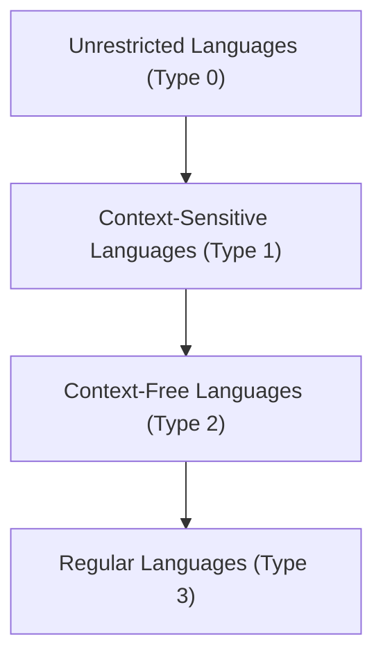
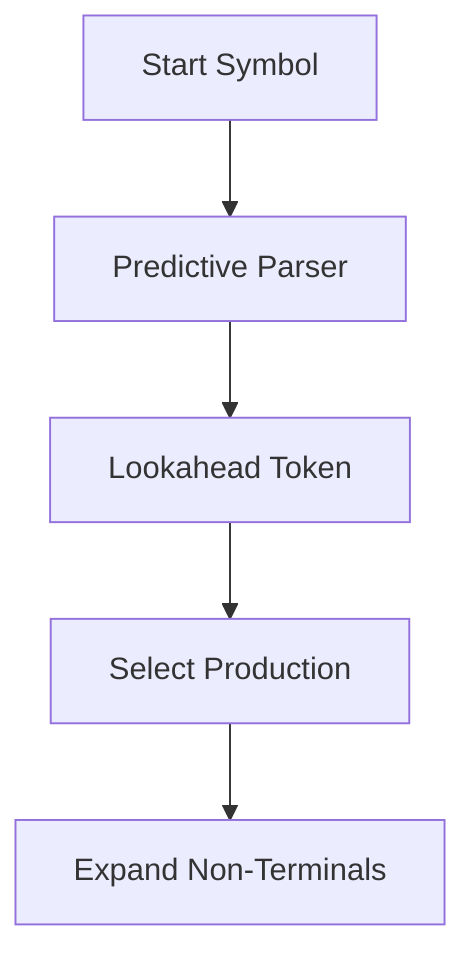

# Chapter 4 – Grammars and Top-Down Parsing

## 4.1 Introduction
In this lecture, Professor Andrea Corradini introduced the theory and practice of **grammars** and their role in defining the syntax of programming languages, with a particular focus on **top-down parsing**. Unlike previous lessons that explored the broader architecture of compilers, this lecture focused on how grammars generate languages, how derivations and parse trees work, and how parsers determine whether a program is syntactically correct【50†Trascrizione】.

## 4.2 Syntax, Semantics, and Pragmatics
To specify a programming language, three aspects are essential:
- **Syntax**: the formal rules that define valid programs (expressed through grammars).
- **Semantics**: the meaning of syntactically valid programs.
- **Pragmatics**: conventions for readability and usability (e.g., paradigms such as object-oriented vs. functional, or naming conventions across languages).

While this lecture concentrated on syntax, it acknowledged the importance of semantics (checked later in compilation) and pragmatics (vital for code readability and maintainability).

## 4.3 Grammars and the Chomsky Hierarchy
A **grammar** is defined as a tuple consisting of:
- A set of terminal symbols (tokens).
- A set of non-terminal symbols.
- A set of productions (rewriting rules).
- A start symbol.

The **Chomsky hierarchy** classifies grammars by expressive power:
1. **Regular grammars (Type 3)** – can be recognized by **finite automata**.
2. **Context-free grammars (Type 2)** – can be recognized by **pushdown automata** (with a stack).
3. **Context-sensitive grammars (Type 1)** – require more complex automata.
4. **Unrestricted grammars (Type 0)** – equivalent to **Turing machines**.

Each level strictly includes the previous one. For example:
- Finite languages are regular.
- The language `{a^n b^n}` is context-free but not regular.
- The language `{a^n b^n c^n}` is context-sensitive but not context-free【50†Trascrizione】.


*Figure 4.1 – The Chomsky hierarchy of grammars.*

## 4.4 Derivations and Parse Trees
- A **derivation** is a sequence of steps applying productions to generate strings from the start symbol.
- **Leftmost derivations** always expand the leftmost non-terminal first.
- **Rightmost derivations** always expand the rightmost non-terminal first.

A **parse tree** represents the structure of a derivation:
- Root: the start symbol.
- Internal nodes: non-terminals expanded by productions.
- Leaves: terminal symbols (tokens).

Parse trees abstract away from the order of derivations, offering a canonical representation of structure. However, a grammar may be **ambiguous**, meaning that multiple parse trees can yield the same string. This is problematic because ambiguity can imply multiple interpretations of the same program.

### Example: Ambiguity
For arithmetic expressions with `+` and `-`, the string `9 - 5 + 2` can be parsed in two ways:
- `(9 - 5) + 2 = 6`
- `9 - (5 + 2) = 2`

To resolve ambiguity, programming languages adopt:
- **Operator precedence** (e.g., `*` has higher precedence than `+`).
- **Associativity rules** (e.g., `+` and `-` are left-associative).

Another classical ambiguity is the **dangling else problem** in conditional statements, where an `else` clause could be attached to multiple `if` statements. Most languages resolve this by attaching the `else` to the nearest unmatched `if`【50†Trascrizione】.

## 4.5 Lexical and Syntax Grammars
Programming languages typically separate two grammars:
- **Lexical grammar (regular)**: defines how characters group into tokens. Implemented via **regular expressions** and finite automata.
- **Syntax grammar (context-free)**: defines how tokens combine into valid structures (statements, expressions).

Some constraints (e.g., variables must be declared before use, or matching numbers of actual and formal parameters) cannot be expressed in context-free grammars. These are enforced later during **semantic analysis**【50†Trascrizione】.

## 4.6 Parsing Techniques
Parsing is the process of determining if a sequence of tokens belongs to the language defined by a grammar. General parsing algorithms may have cubic complexity (O(n³)) and are impractical for real-world programming languages. Instead, compilers use efficient algorithms based on restricted grammars.

### 4.6.1 Top-Down Parsing
- Constructs the parse tree from the root down to the leaves.
- Straightforward to implement: each non-terminal corresponds to a procedure that attempts to match input.
- Naive recursive descent with backtracking is **exponential** in complexity.

### 4.6.2 Predictive Parsing (LL Parsing)
- Restricts grammars to avoid backtracking.
- Uses **lookahead tokens** to decide which production to apply.
- Achieves **linear time parsing**.


*Figure 4.2 – Simplified predictive parsing strategy.*

#### First and Follow Sets
To build predictive parsers, two sets are computed:
- **First(α)**: the set of tokens that can begin strings derived from α.
- **Follow(A)**: the set of tokens that can immediately follow the non-terminal A in derivations.

These sets help ensure that the grammar is suitable for predictive parsing (LL(1) grammars).

#### Eliminating Left Recursion
Predictive parsers cannot handle **left-recursive grammars** (where a non-terminal can derive itself as the first symbol). Transformations exist to eliminate left recursion by rewriting productions into right-recursive forms.

## 4.7 Practical Examples
During the lecture, small grammars were used to illustrate predictive parsing. A demonstration with ChatGPT showed how a grammar could be translated into recursive parsing functions, and how **lookahead tokens** allow parsers to decide which production to apply without backtracking【50†Trascrizione】.

```csharp
void Expr() {
    Term();
    while (lookahead == '+' || lookahead == '-') {
        Token op = lookahead;
        match(op);
        Term();
    }
}
```
*Figure 4.3 – Example of recursive descent parsing function for expressions.*

## 4.8 Conclusion
This lecture emphasized how **grammars formalize syntax**, how **parse trees** ensure structured representation, and how **ambiguity must be resolved** to ensure deterministic semantics. Top-down parsing, and in particular **predictive (LL) parsing**, was presented as an efficient and widely adopted strategy for real-world compilers.

Professor Corradini concluded by highlighting the complementarity of teaching styles: *“I feel very much like a compiler, where Antonio is an interpreter.”*【50†Trascrizione】

